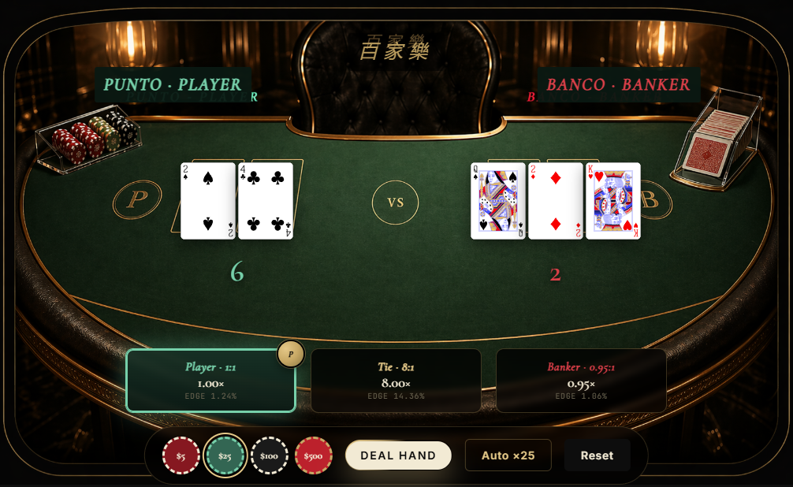

# Play Baccarat

An interactive web guide to baccarat: the rules, the odds, the drawing tableau, and a live Punto Banco dealer you can actually sit down and play against. Static HTML/CSS/JS, no build step, no backend.



## Run it

```bash
python -m http.server 8000
# open http://localhost:8000
```

Do not open `index.html` via `file://` — the Three.js scroll stage needs HTTP for the GLB table model and Google Fonts.

## What's inside

- Ten guided sections covering rules, card values, the drawing tableau, house-edge math, betting systems, and the roads
- A scroll-driven 3D dealing table (Three.js) that walks through a single coup over six camera keyframes
- A live Punto Banco simulator with full tableau logic, 8-deck shoe, bankroll, auto-deal, a hand-result explainer for the first two hands, and a live Big Road built from your outcomes

## License

MIT — see [LICENSE](LICENSE). Educational use. Nothing here is gambling advice.
